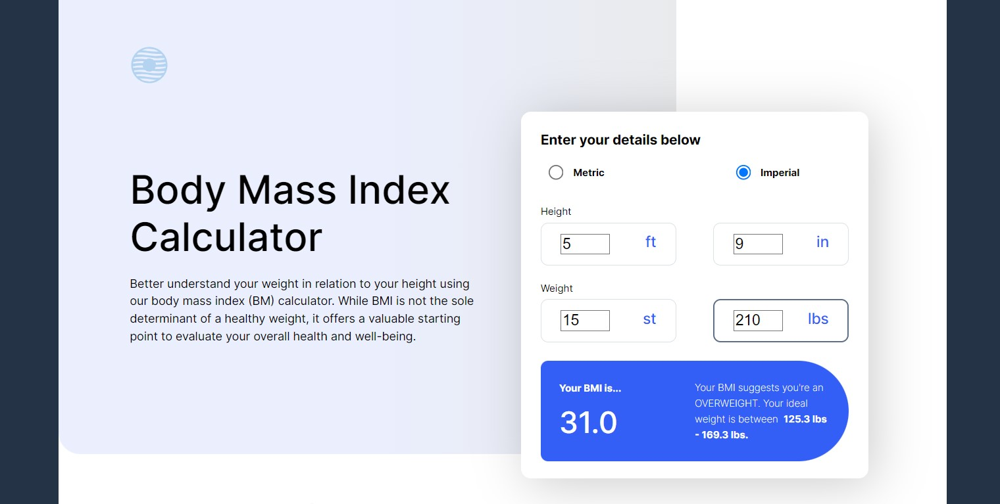
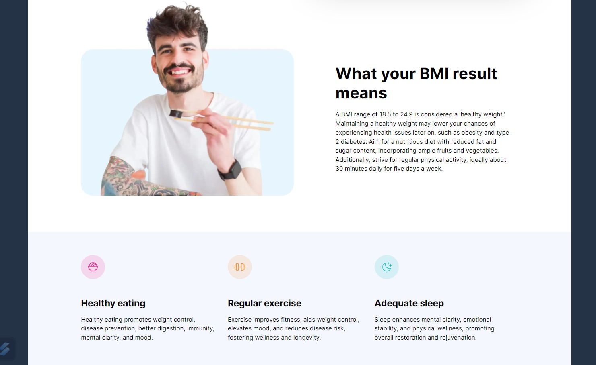
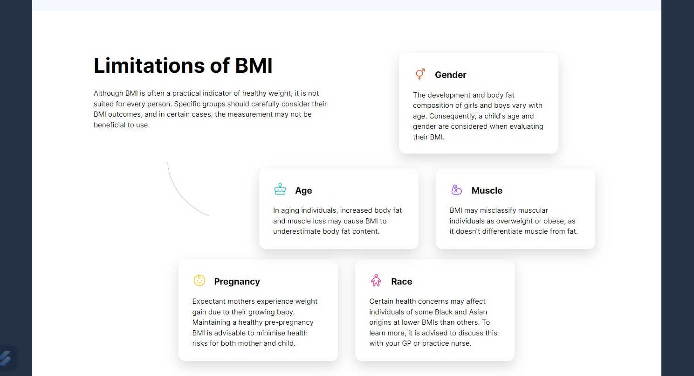

# Frontend Mentor - Body Mass Index Calculator solution

This is a solution to the [Body Mass Index Calculator challenge on Frontend Mentor](https://www.frontendmentor.io/challenges/body-mass-index-calculator-brrBkfSz1T). Frontend Mentor challenges help you improve your coding skills by building realistic projects. 

## Table of contents

- [Overview](#overview)
  - [The challenge](#the-challenge)
  - [Screenshot](#screenshot)
  - [Links](#links)
- [My process](#my-process)
  - [Built with](#built-with)
  - [What I learned](#what-i-learned)
  - [Continued development](#continued-development)
  - [Useful resources](#useful-resources)
- [Author](#author)
- [Acknowledgments](#acknowledgments)

**Note: Delete this note and update the table of contents based on what sections you keep.**

## Overview

### The challenge

Users should be able to:

- Select whether they want to use metric or imperial units
- Enter their height and weight
- See their BMI result, with their weight classification and healthy weight range
- View the optimal layout for the interface depending on their device's screen size
- See hover and focus states for all interactive elements on the page

#### Note: When the user selects working with ST mass units (stones), these are converted and processed as lbs (pounds). The output result is also shown in lbs. (1 Stone = 14 lbs)


### Screenshot (the three desktop screen sections)






### Links


- Solution URL:  [Github repository](https://github.com/memominguez/bmi-calculator
)
- Live Site URL:  [Netlify](https://your-fitness-bmi.netlify.app)

## My process

### Built with

- Semantic HTML5 markup
- CSS / SASS custom properties
- Flexbox
- Mobile-first workflow
- [React](https://reactjs.org/) - JS library
- [Vite](https://vitejs.dev/) - Frontend dev tool


### What I learned

- Modify the input form layout by selecting the className programmatically

```html
 const [unitSys, setUnitSys] = useState("metric");

  return (
    <div className={`input-output-container ${unitSys}`}>
      <form className="input">
        <h2 className="input__title">Enter your details below</h2>

        <div className="input__buttons">
          <div className="input__buttons-group">
            <input
              type="radio"
              name="unit-syst"
              value="metric"
              id="metric"
              onChange={(e) => setUnitSys(e.target.value)}
              checked={unitSys == "metric"}
            />            
            <label htmlFor="metric">Metric</label>
          </div>
```
```css
@media only screen and (min-width: 1440px) {
  .input-output-container:is(.metric) {
    --desktop-height: 466px;
    --output-offset: 286px;
  }
  .input-output-container:is(.imperial) {
    --desktop-height: 595px;
    --output-offset: 405px;
  }

  .input-output-container {   
    top: 181px;
    left: 750px;
    width: 564px;
    height: var(--desktop-height);
  } 
```


- Delayed re-render of output results until the user finishes his/her input data. In this case, the app waits 800 ms for the next key-in, before updating the output results.


```js
  const [heightcm, setHeightcm] = useState(1);
  const [delayedHeightcm, setDelayedHeightcm] = useState(1);
  const [weightkg, setWeightkg] = useState(0);
  const [delayedWeightkg, setDelayedWeightkg] = useState(0);

  useEffect(() => {
    const timeoutId = setTimeout(() => {
      setDelayedHeightcm(heightcm);
    }, 800);

    return () => clearTimeout(timeoutId);
  }, [heightcm]);
```


### Continued development


Continue improving my coding skills by developing challenging applications, like this one.


### Useful resources

- [Wikipedia](https://en.wikipedia.org/wiki/Body_mass_index) - Here found the formulae for the BMI calculation.
- [Calculator.net](https://www.calculator.net/bmi-calculator.html) - This was useful for comparing our results.

- ChatGPT. Provided a sample code for the case of delayed re-rendering.

## Author


- Website - [Guillermo Dominguez](https://gdominguez-portfolio.netlify.app)
- Frontend Mentor - [@memominguez](https://www.frontendmentor.io/profile/memominguez)


## Acknowledgments

Thanks to all those who share their knowledge, free of charge, through video tutorials in the youtube platform.

Also thanks to the creators and sponsors of ChatGPT. 
